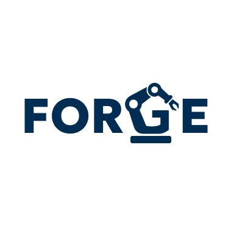

# FORGE: Formation of Optimized Robotic Groundtruth Examples

<p align="center">
  
</p>

FORGE is a C++-based inverse kinematics and metaheuristic-gradient descent hybrid optimization framework that uses YAML-based configuration and Eigen for matrix computations. It supports multi-core execution and is designed for robotic systems defined via Denavit–Hartenberg (DH) parameters. Additionally, it utilizes KD-Tree nearest-neighbor searches to replicate and recreate similar points, enabling consistent and high-quality dataset generation.

---

## 🚀 Features

- Load robot configuration from `.yaml` files
- Support for DH parameter models
- Inverse Kinematics solver using Gradient Descent
- Multi-core support using `std::thread`
- Clean and modular C++ struct-based design
- YAML and Eigen-based configuration and math
- KD Trees for nearest neighbour search for initial population generation in metaheuristics
---

## 🛠️ Build Instructions

### ✅ Prerequisites

Make sure the following dependencies are installed:

#### Fedora:
```bash
sudo dnf install eigen3-devel yaml-cpp-devel nlohmann-json-devel
```

#### Ubuntu:
```bash
sudo apt install libeigen3-dev libyaml-cpp-dev nlohmann-json3-dev
```

For recompiling C++ binding in `scene_designer/`, pybind11 is required, which can be installed using:
```bash
pip3 install pybind11
```
---

### 🔧 Build Using Make

```bash
make
```

Or manually:

```bash
g++ main.cpp -I/usr/include/eigen3 $(pkg-config --cflags --libs yaml-cpp) -std=c++17 -o FORGE_linux
```

---

### 🛠️ Build Using CMake (Recommended)

```bash
mkdir build
cd build
cmake ..
make
```

The compiled binary `FORGE_linux` will be located in the `build/` directory.

---

### 🧹 Clean Build Files
```bash
make clean
```

Or if using CMake:
```bash
rm -rf build/
```

---

## 📂 YAML Format Example

```yaml
dh_parameters:
  - a: 0
    d: 746
    alpha: 90
  - a: 1250
    d: 0
    alpha: 0
  - a: 250
    d: 0
    alpha: 90
  - a: 0
    d: 1000
    alpha: -90
  - a: 0
    d: 0
    alpha: 90
  - a: 0
    d: 200
    alpha: 0
```

---

## 📂 JSON Format Example

```json
[
    {
        "type": "cube",
        "position": [-100, 200, 0],
        "size": [200, 250, 250],
        "color": "green"
    },
    {
        "type": "cylinder",
        "position": [250, 100, 0],
        "radius": 100,
        "height": 550,
        "color": "pink"
    },
    {
        "type": "sphere",
        "position": [250, 100, 550],
        "radius": 300,
        "color": "pink"
    }
]
```

---


## 🧪 Usage

```bash
./FORGE_linux config.yaml scene.json 4 2000
```

- `config.yaml`: YAML file containing DH parameters
- `scene.json`: JSON file containing environment scene
- `4`: Number of threads to use (multi-core optimization)
- `2000`: Number of datapoints user needs to generate

---

## 🧰 Scene Designer

The `scene_designer/` module provides a lightweight, interactive 3D design and simulation tool for building and testing robotic scenes. It supports real-time collision checking using fast C++ geometry routines wrapped with `pybind11`. Users can load robot models via DH parameter `YAML` files and interactively adjust joint angles using sliders. Additionally, the tool allows you to define obstacles (cubes, spheres, cylinders) in a scene `JSON` file—which is monitored and automatically reloaded live whenever changes are made. This enables rapid prototyping and seamless scene tweaking without restarting the application.

### 🧪 Usage
```bash
python3 Designer.py scene_file.json dh_file.yaml
```

---

## 📁 Project Structure

```
FORGE/
├── CMakeLists.txt                      # CMake build script
├── LICENSE                             # Project license
├── Makefile                            # Makefile for building
├── main.cpp                            # Entry point for IK/robotics experiments
├── visualise_fk_csv.py                 # Visualizer to display FK output from CSV
│
├── example_dh_parameters/              # DH parameter YAML files for various robots
│   ├── fanuc_m20ia.yaml
│   ├── kawasaki_bx200l.yaml
│   ├── kuka_youbot.yaml
│   └── tm5_700.yaml
│
├── gradientDescent/
│   └── gradientDescent.h              # Gradient Descent implementation
│
├── metaheuristics/                    # Metaheuristic algorithm implementations
│   ├── differentialEvolution.h
│   ├── geneticAlgorithm.h
│   ├── particleSwarmOptimization.h
│   ├── socialGroupOptimization.h
│   └── teachingLearningBasedOptimization.h
│
├── scene_designer/                    # Scene designer tool with collision bindings
│   ├── Designer.py                    # Interactive 3D scene design with sliders
│   ├── designer_bindings.cpp          # Pybind11 bindings for collision functions
│   ├── designer_modules_cpp.cpyth...  # Compiled Python module for collisions
│   ├── example_scene.json             # Example 3D scene layout
│   └── Makefile
│
├── src/                                # Core utility functions and headers
│   ├── collision_utils.h
│   ├── debug_utils.h
│   ├── io_utils.h
│   ├── nearest_neighbor_utils.h
│   ├── random_utils.h
│   ├── robomath_utils.h
│   └── types.h
│
└── README.md                 # You're reading it!

```

## 📄 Output CSV Format

After running an algorithm, FORGE generates a `.csv` file logging each inverse kinematics attempt with the following structure:

| initial_ang_1 | initial_ang_2 | initial_ang_1 | initial_ang_4 | initial_ang_5 | initial_ang_6 | target_pos_x | target_pos_y | target_pos_z | final_ang_1 | final_ang_2 | final_ang_3 | final_ang_4 | final_ang_5 | final_ang_6 | algorithm |
|------|------|------|------|------|------|--------|--------|--------|--------|--------|--------|--------|--------|--------|--------|
| 0.12 | 0.35 | 0.78 | -0.2 | 1.05 | 0.66 | 500.0  | 200.0  | 300.0  | 0.11   | 0.33   | 0.80   | -0.21  | 1.04   | 0.65   |PSO_Adam|

### Column Details:

- **initial_ang_1–initial_ang_6**: Initial joint angles provided as input to the solver.
- **target_pos_x, target_pos_y, target_pos_z**: Desired 3D end-effector position (target).
- **final_ang_1-final_ang_6**: Output joint angles predicted by the solver to achieve the target.

These CSV files are useful for:
- Evaluating solver accuracy (e.g., how close output angles reach the target)
- Debugging IK performance
- Training or benchmarking machine learning models

---

## 📈 Visualizing a Single IK Output

To visualise a single row from the output CSV file, use the provided `visualiser.py` script.

### 🖥️ Usage

```bash
python visualise_fk_csv.py <config.yaml> <data_line>
```

### 📌 Example

```bash
python visualise_fk_csv.py example_dh_parameters/config.yaml "4.78,5.97,0.45,0.50,5.16,2.71,-657.6,1688.0,730.3,1.88,6.17,1.44,1.40,4.82,2.71,PSO_Adam"
```

- `<config.yaml>`: Path to the YAML file containing your robot's DH parameters  
- `<data_line>`: A comma-separated line copied from your output CSV (enclosed in double quotes)

This tool reconstructs and displays the forward kinematics output of the predicted joint angles, helping you verify accuracy visually.

---

## 📜 License

This project is released under the [MIT License](LICENSE).

---

## 📊 Dataset on Kaggle

You can explore and download the dataset used for training and evaluation here:

🔗 [FORGE Inverse Kinematics Dataset on Kaggle](https://www.kaggle.com/datasets/rhiddhiprasaddas/forge-ik-2025/)


## 👨‍🔬 Author

**Rhiddhi Prasad Das**  
Built for research in robotic inverse kinematics and optimization.

## 🙌 Testers
Thanks to the following people for helping test the program:

- @Ari-gay-tor
- @imon1207
- @tiya-513
- @SLSi14
- @Shivangid2904

If you use this work, please cite:
Das, R. P. (2026). FORGE: Formation of Optimized Robotic Ground-Truth Examples. Zenodo. https://doi.org/10.5281/zenodo.19396738
